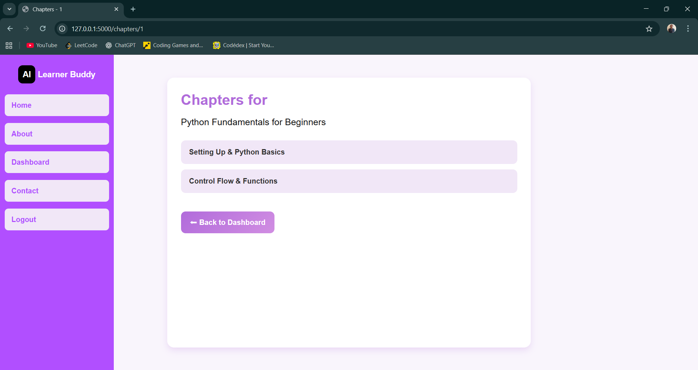
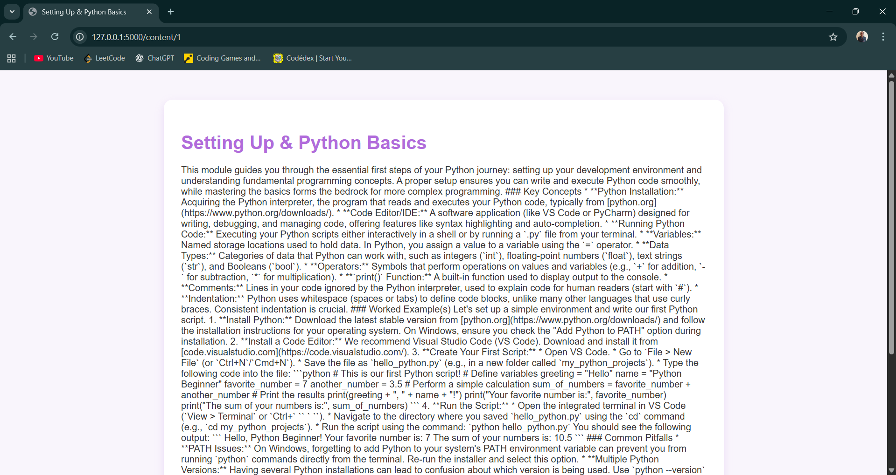

# AI-Learner-Buddy
AI Learner Buddy is an AI-powered course creation and learning platform. It allows users to generate structured courses, chapters, and detailed chapter content dynamically using AI. Built with Flask, SQLite, and Google’s Generative AI, it provides an intuitive interface for managing personalized learning journeys.
## > Features So Far

- **User Authentication**
  - Register, login, and logout functionality.
  - Password hashing for security.
- **Course Management**
  - Create new courses with a title, difficulty level, and number of chapters.
  - View a list of created courses.
- **Chapter Management**
  - Auto-generate chapter titles using AI.
  - View a list of chapters for each course.
- **Content Generation**
  - Generate detailed content for each chapter dynamically via AI.
- **Navigation**
  - Dashboard showing all courses and basic statistics.
  - Structured navigation between dashboard, courses, chapters, and content.
- **Responsive UI**
  - Modern interface built using HTML, CSS, and Bootstrap.

---

## > Tech Stack

- **Backend:** Python, Flask  
- **Frontend:** HTML, CSS, Bootstrap  
- **Database:** SQLite  
- **AI Integration:** Google Generative AI API  
- **Authentication:** Flask sessions, password hashing with Werkzeug  

---
## > Example Output

### Main Page  

### Login Page  

### Register Page  

### Dashboard Page  

### Chapter List Page  

### Chapter Content Page  

### About Page  

---
## > Work in Progress

This project, **AI Learner Buddy**, is still under active development.  
Currently, it provides the core functionality for user authentication, course creation, chapter generation, and AI-powered content generation.  

Future improvements planned include:

-  Enhanced AI Generation for richer course generation  
-  Improved UI/UX with responsive design and user-friendly interactions  
-  Course saving and progress tracking    
-  Interactive quizzes at the end of each course to test knowledge  
-  More robust error handling and input validation    

This is a learning and evolving project. The aim is to create a fully functional, intelligent course builder that bridges education and AI seamlessly.  
Contributions, suggestions, and feedback are welcome!
**Note:** Screenshots and outputs shown in this README are from the current working version and may change as features are enhanced.
